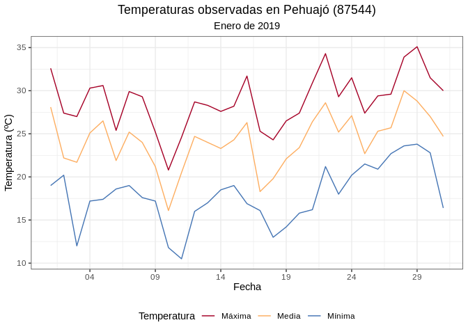
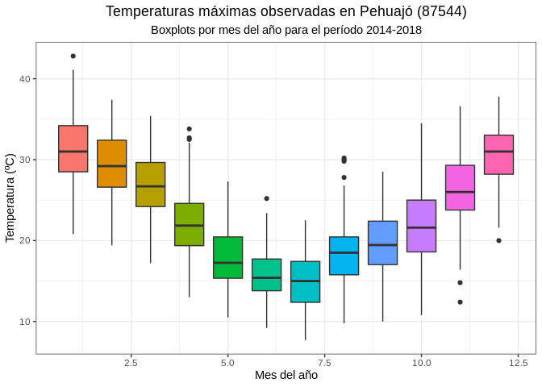
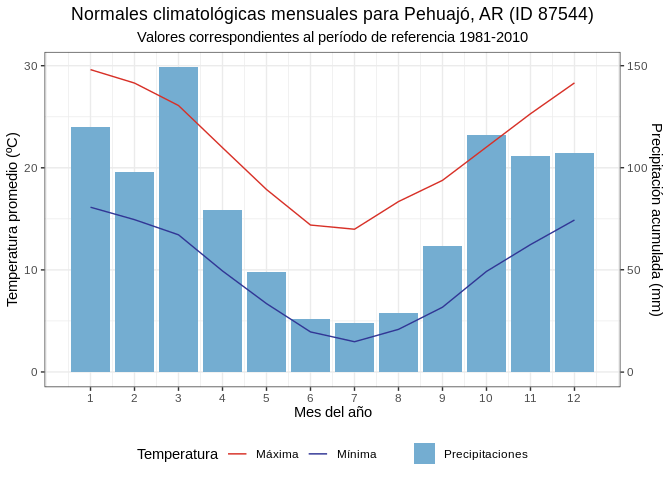
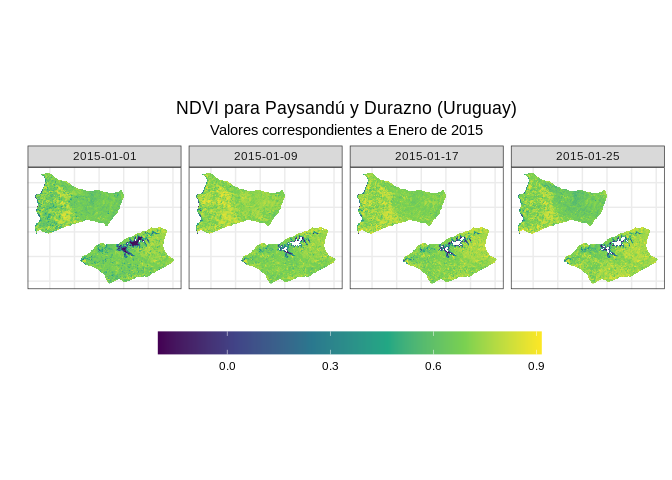
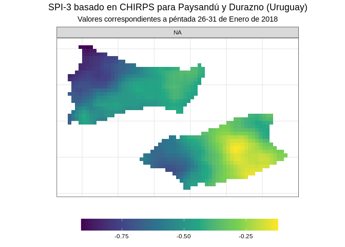
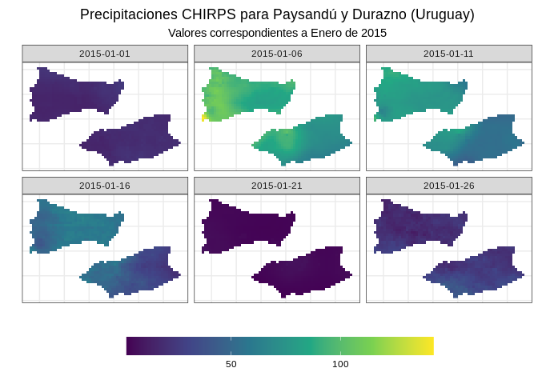

# Manual de acceso a datos administrados por el Centro Regional del Clima para el Sur de América del Sur (CRC-SAS)

## Documentación y ejemplos en languaje R de acceso programático (API)

#### Santiago Rovere (<srovere@gmail.com>)

#### Daniel Bonhaure (<danielbonhaure@gmail.com>)

#### Guillermo Podestá (<gpodesta@rsmas.miami.edu>)

#### 09 de diciembre de 2020

# 1\. Introducción

El presente documento tiene como propósitos:

  - describir los diferentes conjuntos de datos que el CRC-SAS provee a
    sus miembros y colaboradores mediante la interfaz descripta más
    abajo;
  - explicar el mecanismo de acceso a los datos, detallando los formatos
    de entrada y salida de la información; y
  - proveer ejemplos de implementación que faciliten al usuario el
    acceso a los datos.

El público al cual está destinado este documento está conformado por
desarrolladores de software, programadores científicos o investigadores
interesados en acceder a algunos de los datos del CRC-SAS. En cualquier
caso, se asume que el lector tiene conocimientos previos de
programación.

La provisión de datos por parte del CRC-SAS se hace a través de lo que
se llama API (**A**pplication **P**rogramming **I**nterface), que ofrece
una una forma de comunicarse e interactuar con un servidor computacional
remoto para acceder a datos almacenados en ese servidor. Una API
generalmente involucra un conjunto de funciones que se proveen a fin de
ser utilizadas por otro software implementado por el usuario \[1\]. El
acceso a esta API no es interactivo ni a través de una interfaz gráfica,
sino programático (o sea, a través de un código implementado en un
lenguaje de programación). Es importante destacar también que la API que
se describe aquí es un prototipo experimental, por lo que está sujeta a
posibles modificaciones sustanciales en su funcionamiento.

# 2\. Conjuntos de datos disponibles en el CRC-SAS

La API descrita en este documento provee acceso a información organizada
en los siguientes conjuntos de datos:

  - datos *sobre* estaciones meteorológicas (o metadatos);
  - registros de observaciones in situ de distintas variables
    meteorológicas a nivel diario;
  - estadísticas y climatologías;
  - índices de sequía;
  - eventos secos y húmedos identificados mediante índices de sequía;
  - índices de vegetación (NDVI y EVI) derivados a partir de datos
    satelitales;
  - precipitaciones estimadas combinando datos de satélite e in situ
    (CHIRPS);
  - pronósticos de precipitación y sequía a 15 días (CHIRPS-GEFS);
  - índice de stress evaporativo (ESI) y percentiles derivados.

Cada uno de los conjuntos de datos accesibles se describirá en más
detalle en la sección *Servicios*.

# 3\. Acceso programático a los datos

La API aquí descrita provee acceso a los conjuntos de datos listados
arriba, mediante servicios web REST. Los servicios web REST (por
**RE**presentational **S**tate **T**ransfer) son interfaces de software
que permiten la interoperabilidad entre sistemas remotos (en este caso,
entre el CRC-SAS y el software desarrollado por un usuario) \[2\].
Cuando se accede mediante una API a *servicios web* los requerimientos
de datos se realizan a través de *requests* (o solicitudes) que siguen
el protocolo HyperText Trasfer Protocol o HTTP. Un request HTTP es un
mensaje que la computadora del usuario envía a un servidor.

Por cuestiones de confidencialidad estipuladas por los países miembros
del CRC-SAS, esta API no es de acceso público. Por el contrario, el
acceso a los servicios provistos se encuentra restringido por un
mecanismo denominado *Basic Authentication HTTP* \[3\]. Este mecanismo
permite que un usuario acceda a los servicios ingresando un usuario y
una clave. Para solicitar un usuario y clave, enviar un mensaje por
correo electrónico a *<proyecto.sissa@gmail.com>* indicando su
afiliación con una institución miembro del CRC-SAS.

El mecanismo de autenticación determina quién tiene acceso a los
servicios. Luego de la autenticación existe un segundo mecanismo de
control de acceso (autorización) para determinar qué servicios puede
consumir cada usuario. Este acceso responde a las políticas provisorias
de distribución de datos del CRC-SAS. Por ejemplo, solamente los
miembros de los 6 servicios meteorológicos e hidrológicos de los países
del CRC-SAS pueden acceder a los registros de observaciones in situ a
nivel diario. Los servicios serán provistos desde la URL base
<https://api.crc-sas.org>.

# 4\. Servicios

Todos los ejemplos provistos en este documento están implementados en el
lenguaje R \[4\]. Un documento similar \[5\] muestra los mismos ejemplos
en lenguaje Python \[6\]. A fin de enfocarnos en la explicación de cada
servicio y su uso, definiremos primero algunas funciones de uso común
que nos permitan agilizar la programación. Estas funciones además
permitirán que el usuario no tenga que implementar por su cuenta algunas
partes del código, por ejemplo la obtención de los datos, la
autenticación o la conversión de los datos de salida a un formato que
permita una sencilla manipulación subsiguiente de los mismos.

En primer lugar, se cargarán todos los paquetes de R necesarios para
poder ejecutar el código y los ejemplos provistos en adelante. Si alguno
de estos paquetes no está instalado, los mismos deberán ser instalados
por el usuario a fin de que el código pueda
funcionar.

``` r
# Carga de paquetes necesarios para hacer los requests a la API y graficar resultados
require(Cairo)
require(dplyr)
require(geojsonsf)
require(ggplot2)
require(glue)
require(httr)
require(jsonlite)
require(knitr)
require(lubridate)
require(ncdf4)
require(raster)
require(tidyr)
require(sf)
```

Luego, indicaremos que se utilice la librería Cairo para generar los
gráficos que se muestran en los ejemplos.

``` r
# Uso de paquete Cairo para generar gráficos
options(bitmapType = "cairo")
```

A continuación, definiremos un set de funciones R útiles que le
permitirán al usuario acceder a la API de una forma muy sencilla, sin
tener que detenerse en detalles como la autenticación o la conversión de
datos
devueltos.

``` r
# Función para acceder a un servicio web definido por una URL utilizando el método GET.
# Devuelve la respuesta como texto plano.
ConsumirServicioGET <- function(url, usuario, clave) {
  req  <- httr::GET(url = url, 
                    config = httr::authenticate(user = usuario, 
                                                password = clave))
  return (httr::content(req, as = "text"))
}

# Función para acceder a un servicio web definido por una URL utilizando el método POST.
# Devuelve la respuesta como raw.
ConsumirServicioPOST <- function(url, usuario, clave, body) {
  req  <- httr::POST(url = url, 
                     config = httr::authenticate(user = usuario, 
                                                 password = clave),
                     body = body, encode = "json")
  return (httr::content(req, as = "raw"))
}

# Función para acceder a un servicio web definido por una URL utilizando un usuario y clave.
# Asumiendo que la respuesta es un string JSON, hace la conversión del mismo a Data Frame.
ConsumirServicioJSON <- function(url, usuario, clave) {
  respuesta <- ConsumirServicioGET(url, usuario, clave)
  return (jsonlite::fromJSON(respuesta))
}

# Función para acceder a un servicio web definido por una URL utilizando un usuario y clave.
# Se envía un archivo GeoJSON para realizar la consulta en un área determinada.
# La respuesta se devuelve con un objeto de tipo raster.
ConsumirServicioEspacial <- function(url, usuario, clave, archivo.geojson.zona) {
  # a. Obtener datos y guardarlos en un archivo temporal
  zona.geojson     <- readr::read_file(file = archivo.geojson.zona)
  respuesta        <- ConsumirServicioPOST(url = url, usuario = usuario, clave = clave,
                                           body = list(zona.geojson = zona.geojson))
  archivo.temporal <- base::tempfile("raster_ws_api")
  un.archivo       <- base::file(archivo.temporal, "wb")
  base::writeBin(respuesta, un.archivo)
  close(un.archivo)
  
  # b. Obtener CRS y fechas del NetCDF
  archivo.nc <- ncdf4::nc_open(filename = archivo.temporal)
  prj4string <- ncdf4::ncatt_get(archivo.nc, 0, "crs")$value
  fechas     <- NULL
  tryCatch({
    fechas <- as.Date(ncdf4::ncvar_get(archivo.nc, "time"), origin = as.Date("1970-01-01"))  
  }, error = function(e) {
    # No hay variable de tiempo porque es un solo layer. Poner como fecha el atributo start_date
    fechas <<- as.Date(ncdf4::ncatt_get(archivo.nc, 0, "start_date")$value)
  }, finally = { 
    ncdf4::nc_close(archivo.nc)
  })
  
  # c. Convertir a raster y borrar archivo temporal
  un.raster <- raster::stack(x = archivo.temporal) %>%
    raster::readAll()
  raster::crs(un.raster) <- prj4string
  if (raster::nlayers(un.raster) > 1) {
    names(un.raster) <- as.character(fechas)
  }
  un.raster <- raster::setZ(un.raster, fechas)
  file.remove(archivo.temporal)  
  return (un.raster)
}

# Convierte una fecha a formato IS0 8601 (YYYY-MM-DDTHH:mm:ss) utilizando el huso horario GMT-0.
# Este es formato un estándar para representar fechas como una cadena de caracteres [7].
ConvertirFechaISO8601 <- function(fecha) {
  return (strftime(fecha, "%Y-%m-%dT%H:%M:%S", tz = "UTC"))
}
```

Además, a efecto de poder probar los ejemplos de esta documentación, se
definen las siguientes variables (los datos de usuario y clave se
encuentran ocultos por cuestiones de seguridad y deberán ser solicitados
a las instituciones miembros del CRC-SAS):

``` r
base.url        <- 'https://api.crc-sas.org/ws-api'
usuario.default <- '********' 
clave.default   <- '********'
```

La variable *base.url* representa la dirección URL base (Uniform
Resource Locator \[8\]) común a todos los servicios. Cada servicio está
unívocamente identificado por una URL que se construye a partir de la
URL base y una ruta (o ubicación) asociada al mismo. Esta construcción
se hace mediante la concatenación de la URL base y la ruta. Cada
servicio asociado a un conjunto de datos puede ser identificado
unívocamente por una ruta. Las diferentes rutas se describen más abajo.
A modo de ejemplo, para acceder al servicio de datos sobre estaciones se
tomará la URL base (<https://api.crc-sas.org/ws-api>) y se la
concatenará con la ruta de dicho servicio (/estaciones) resultando en
la URL completa para este servicio
(<https://api.crc-sas.org/ws-api/estaciones>). Las variables
*usuario.default* y *clave.default* son las credenciales de acceso
necesarias para poder realizar la autenticación y obtener los datos
buscados.

A continuación, se describirá en detalle cada conjunto de datos y los
servicios provistos para acceder a los mismos. Para cada servicio se
proveerá la siguiente información:

  - ruta (anteriormente descripta);
  - método (indica el tipo de request que se debe realizar - GET o POST)
  - parámetros (dado que la ruta puede contener algunos filtros
    necesarios para poder obtener la información solicitada, por
    ejemplo, el país para el cual se buscan datos de estaciones);
  - respuesta (formato o estructura con que se devuelven los datos,
    generalmente en formato JSON el cual puede transformar a Data Frame
    con las funciones provistas al inicio del documento); y
  - ejemplo de uso implementado en lenguaje R utilizando las funciones y
    variables definidas previamente.

Las rutas para acceder a los servicios web pueden contener parámetros
que deba proveer el usuario. Por ejemplo, como se verá más adelante, si
un usuario quiere buscar solamente las estaciones de Argentina, deberá
proveer la siguiente ruta: /estaciones/AR. A efectos de proveer una
especificación de la ruta que sea más general diremos que la ruta
asociada a dicho servicio es la siguiente:
/estaciones/{iso\_pais:string} (donde iso\_pais indica el código ISO de
2 caracteres para un país).

Todo contenido de una ruta englobado dentro de llaves representa un
parámetro. En este caso, el parámetro es *iso\_pais* y se indica que su
tipo de dato es un *string*. Luego, en el listado de parámetros que se
detalla a continuación de la ruta se especifica con mayor detalle qué
valores pueden tomar los parámetros que contiene la ruta.

El método de consulta (GET o POST) indica la forma en que los parámetros
son enviados a la API. El método GET se utiliza para enviar parámetros
de longitud limitada como parte de la ruta o del *query string* (la
parte de la ruta que viene a continuación del símbolo *?*). El método
POST se utiliza para enviar parámetros cuyo tamaño excede el límite
establecido para las consultas por método GET. Dichos parámetros se
envían embebidos dentro del cuerpo de la consulta. Sin embargo, las
funciones definidas previamente permitirán realizar estas consultas de
forma transparente para el usuario.

## 4.1. Datos *sobre* estaciones meteorológicas

A la fecha de escritura de este documento, la base de datos del CRC-SAS
contiene observaciones para 356 estaciones meteorológicas convencionales
distribuidas en seis países: Argentina, Bolivia, Brasil, Chile, Paraguay
y Uruguay. A su vez, cada estación pertenece a una institución (o red)
del país correspondiente. Al momento, el único país que provee
estaciones de dos instituciones distintas es Argentina (SMN e INTA).
Todos los demás países proveen estaciones de una única institución.

Para cada estación, se puede consultar información relativa a la misma
(metadatos). Por ejemplo: código internacional de OMM, nombre, ubicación
en latitud/longitud decimales, elevación respecto al nivel del mar, etc.
Con el propósito de poder acotar el conjunto de estaciones cuyos datos
se desea obtener, existen cuatro maneras de seleccionar las mismas:

  - todas las estaciones;
  - estaciones de un país;
  - estaciones de un país y de una institución o red; y
  - estaciones geográficamente vecinas.

### 4.1.1. Estaciones de todos los países

*Ruta*: /estaciones

*Método*: GET

*Parámetros*: ninguno

*Respuesta*: \[ { omm\_id: integer nombre: string, latitud: float,
longitud: float, elevacion: integer, nivel\_adm1: string, nivel\_adm2:
string, tipo: string (C = convencional, A = automática) }\]

*Ejemplo*:

``` r
# Búsqueda de estaciones a través de servicio web
estaciones <- ConsumirServicioJSON(url = paste0(base.url, "/estaciones"),
                                   usuario = usuario.default, clave = clave.default)

# Vista de las primeras 6 estaciones en una tabla
knitr::kable(estaciones[1:6,])
```

| omm\_id | nombre                      | latitud | longitud | elevacion | nivel\_adm1         | nivel\_adm2          | tipo |
| ------: | :-------------------------- | ------: | -------: | --------: | :------------------ | :------------------- | :--- |
|   87118 | Famaillá INTA               | \-27.05 |  \-65.42 |       363 | Tucumán             | Famaillá             | C    |
|   87131 | La María INTA               | \-28.23 |  \-64.15 |       169 | Santiago del Estero | Silípica             | C    |
|   87144 | Las Breñas INTA             | \-27.08 |  \-61.12 |       102 | Chaco               | Nueve de Julio       | C    |
|   87147 | Pres. Roque Sáenz Peña INTA | \-26.87 |  \-60.45 |        90 | Chaco               | Comandante Fernández | C    |
|   87158 | Colonia Benítez INTA        | \-27.42 |  \-58.93 |        54 | Chaco               | San Fernando         | C    |
|   87180 | Cerro Azul INTA             | \-27.65 |  \-55.43 |       270 | Misiones            | Leandro N. Alem      | C    |

### 4.1.2. Estaciones de un país

*Ruta*: /estaciones/{iso\_pais:string}

*Método*: GET

*Parámetros*:

  - iso\_pais: \[ AR, BO, BR, CL, PY, UY \] (código ISO2 del país para
    el cual se busca estaciones)

*Respuesta*: \[ { omm\_id: integer nombre: string, latitud: float,
longitud: float, elevacion: integer, nivel\_adm1: string, nivel\_adm2:
string, tipo: string (C = convencional, A = automática) }\]

*Ejemplo*:

``` r
# Búsqueda de estaciones de Argentina a través de servicio web
estaciones.argentina <- ConsumirServicioJSON(url = paste0(base.url, "/estaciones/AR"),
                                             usuario = usuario.default, clave = clave.default)

# Vista de las primeras 6 estaciones en una tabla
knitr::kable(estaciones.argentina[1:6,])
```

| omm\_id | nombre                      | latitud | longitud | elevacion | nivel\_adm1         | nivel\_adm2          | tipo |
| ------: | :-------------------------- | ------: | -------: | --------: | :------------------ | :------------------- | :--- |
|   87118 | Famaillá INTA               | \-27.05 |  \-65.42 |       363 | Tucumán             | Famaillá             | C    |
|   87131 | La María INTA               | \-28.23 |  \-64.15 |       169 | Santiago del Estero | Silípica             | C    |
|   87144 | Las Breñas INTA             | \-27.08 |  \-61.12 |       102 | Chaco               | Nueve de Julio       | C    |
|   87147 | Pres. Roque Sáenz Peña INTA | \-26.87 |  \-60.45 |        90 | Chaco               | Comandante Fernández | C    |
|   87158 | Colonia Benítez INTA        | \-27.42 |  \-58.93 |        54 | Chaco               | San Fernando         | C    |
|   87180 | Cerro Azul INTA             | \-27.65 |  \-55.43 |       270 | Misiones            | Leandro N. Alem      | C    |

### 4.1.3. Estaciones de un país y de una institución o red

*Ruta*: /estaciones/{iso\_pais:string}/{institucion:string}

*Método*: GET

*Parámetros*:

  - iso\_pais: ver columna *país* de la tabla siguiente
  - institucion: ver columna *institución* de la tabla siguiente

| institución | país | nombre                                         |
| ----------- | ---- | ---------------------------------------------- |
| SMN         | AR   | Servicio Meteorológico Nacional                |
| INTA        | AR   | Instituto Nacional de Tecnología Agropecuaria  |
| SENAMHI     | BO   | Servicio Nacional de Meteorología e Hidrología |
| INUMET      | UY   | Instituto Uruguayo de Meteorología             |
| DMH         | PY   | Dirección de Meteorología e Hidrología         |
| INMET       | BR   | Instituto Nacional de Meteorologia             |
| DMC         | CL   | Dirección Meteorológica de Chile               |

*Respuesta*: \[ { omm\_id: integer nombre: string, latitud: float,
longitud: float, elevacion: integer, nivel\_adm1: string, nivel\_adm2:
string, tipo: string (C = convencional, A = automática) }\]

*Ejemplo*:

``` r
# Búsqueda de estaciones del SMN (Argentina) a través de servicio web
estaciones.argentina.smn <- ConsumirServicioJSON(url = paste0(base.url, "/estaciones/AR/SMN"),
                                                 usuario = usuario.default, clave = clave.default)

# Vista de las primeras 6 estaciones en una tabla
knitr::kable(estaciones.argentina.smn[1:6,])
```

| omm\_id | nombre           |   latitud |  longitud | elevacion | nivel\_adm1 | nivel\_adm2                | tipo |
| ------: | :--------------- | --------: | --------: | --------: | :---------- | :------------------------- | :--- |
|   87016 | Orán Aero        | \-23.1547 | \-64.3281 |       357 | Salta       | Orán                       | C    |
|   87022 | Tartagal Aero    | \-22.6166 | \-63.7965 |       450 | Salta       | General José de San Martín | C    |
|   87043 | Jujuy Univ. Nac. | \-24.1786 | \-65.3263 |      1302 | Jujuy       | Palpalá                    | C    |
|   87046 | Jujuy Aero       | \-24.3840 | \-65.0955 |       905 | JUJUY       | El Carmen                  | C    |
|   87047 | Salta Aero       | \-24.8443 | \-65.4757 |      1221 | Salta       | Capital                    | C    |
|   87050 | Metán            | \-25.5243 | \-64.9730 |       855 | Salta       | Metán                      | C    |

### 4.1.4. Estaciones geográficamente vecinas

Este servicio permite buscar las estaciones geográficamente vecinas a
una estación determinada (en adelante, llamada *estación central*). Es
posible especificar un radio máximo de búsqueda, una diferencia máxima
de elevación con respecto a la estación central y una cantidad máxima de
estaciones vecinas a devolver.

*Ruta*:
/estaciones\_vecinas/{omm\_id:int}?max\_distancia={max\_distancia:float}\&max\_diferencia\_elevacion={max\_distancia:float}\&max\_vecinas={max\_vecinas:int}

*Método*: GET

*Parámetros*:

  - omm\_id: Id OMM de la estación meteorológica central;
  - max\_distancia (opcional): máximo radio de búsqueda (en km) de
    estaciones vecinas a la central;
  - max\_diferencia\_elevacion (opcional): máxima diferencia de
    elevación (en m) para que una estación sea considerada vecina de la
    estación central; y
  - max\_vecinas (opcional): máxima cantidad de estaciones vecinas a
    retornar (las estaciones vecinas se ordenan primero por distancia y
    luego por diferencia de elevación respecto a la estación central,
    ambas en forma ascendente).

*Respuesta*: \[ { omm\_id: integer nombre: string, latitud: float,
longitud: float, elevacion: integer, nivel\_adm1: string, nivel\_adm2:
string, tipo: string (C = convencional, A = automática), distancia:
float, diferencia\_elevacion: float }\]

*Ejemplo*:

``` r
# Búsqueda de estaciones vecinas de Pehuajó. 
# Se buscan estaciones que estén a menos de 150km de Pehuajó y cuya diferencia de elevación sea menor a 200m.
# También se indica que se buscan las 3 vecinas más cercanas y con menor diferencia de elevación.
omm.central.id             <- 87544
max.distancia              <- 150
max.diferencia.elevacion   <- 200
max.vecinas                <- 3
url.vecinas                <- glue::glue("{base.url}/estaciones_vecinas/{omm.central.id}")
query.vecinas              <- glue::glue("max_distancia={max.distancia}&max_diferencia_elevacion={max.diferencia.elevacion}&max_vecinas={max.vecinas}")
estaciones.vecinas.pehuajo <- ConsumirServicioJSON(url = glue::glue("{url.vecinas}?{query.vecinas}"),
                                                   usuario = usuario.default, clave = clave.default)

# Vista de estaciones vecinas en una tabla
knitr::kable(estaciones.vecinas.pehuajo)
```

|  omm\_id | nombre             |   latitud |  longitud | elevacion | nivel\_adm1  | nivel\_adm2     | tipo | distancia | diferencia\_elevacion |
| -------: | :----------------- | --------: | --------: | --------: | :----------- | :-------------- | :--- | --------: | --------------------: |
| 80000652 | EEA Cesareo Naredo | \-36.5000 | \-62.0000 |       120 | Buenos Aires | Guamini         | A    |   74.2367 |                    33 |
|    87540 | Trenque Lauquen    | \-35.9690 | \-62.7261 |        95 | Buenos Aires | Trenque Lauquen | C    |   79.4900 |                     8 |
|    87539 | Trenque Lauquen    | \-35.9692 | \-62.7262 |        95 | Buenos Aires | Trenque Lauquen | A    |   79.5031 |                     8 |

## 4.2. Registros de observaciones de distintas variables meteorológicas a nivel diario

Los siguientes dos servicios permiten acceder a los valores diarios para
las variables observadas en las estaciones meteorológicas incluidas en
la base de datos del CRC-SAS. La consulta de datos puede realizarse de
dos maneras diferentes:

  - búsqueda de datos para TODAS las variables observadas en UNA
    estación meteorológica; o
  - búsqueda de datos para UNA variable observada en UNA estación
    meteorológica.

Estos servicios, además de devolver los valores diarios de las
variables, incluyen también información resultante de los procesos de
control de calidad y/o verificación manual en caso de haber sido
efectuados. Esta información está presente en el atributo *estado* como
dato categórico o etiqueta. Los valores posibles de las etiquetas son
los siguientes:

  - **A**: el valor de la variable ha sido *aprobado* por el control de
    calidad;
  - **S**: el valor de la variable ha sido declarado como *sospechoso*
    por el control de calidad;
  - **R**: el valor de la variable ha sido declarado como sospechoso por
    el control de calidad pero ha sido *ratificado* durante el proceso
    de verificación manual;
  - **E** : el valor de la variable ha sido declarado como sospechoso
    por el control de calidad y ha sido *eliminado* durante el proceso
    de verificación manual;
  - **C**: el valor de la variable ha sido declarado como sospechoso por
    el control de calidad y ha sido *corregido* durante el proceso de
    verificación manual;
  - **N**: el valor de la variable ha sido declarado como sospechoso por
    el control de calidad y ha sido declarado *no corregible* durante el
    proceso de verificación manual;
  - **N/A**: aún no se ha ejecutado el control de calidad para la
    estación, fecha y variable asociada.

Puede encontrar mayor información acerca del proceso de control de
calidad en
\[<https://www.crc-sas.org/es/pdf/reporte_tecnico_CRC-SAS-2014-001.pdf>\].

### 4.2.1. Búsqueda de datos para *todas* las variables observadas por una estación meteorológica

*Ruta*:
/registros\_diarios/{omm\_id:int}/{fecha\_desde:date}/{fecha\_hasta:date}

*Método*: GET

*Parámetros*:

  - omm\_id: Id OMM de la estación meteorológica;
  - fecha\_desde: Fecha a partir de la cual se buscan datos;
  - fecha\_hasta: Fecha hasta la cual se buscan datos. Debe ser
    posterior a fecha\_desde y la cantidad de días incluidos entre ambas
    fechas no debe superar los 3650 días (o sea, solo se pueden buscar
    aproximadamente 10 años por llamada al servicio).

*Respuesta*: \[ { omm\_id: integer fecha: date, variable\_id: string,
estado: string, valor: float
}\]

*Ejemplo*:

``` r
fecha.desde           <- ConvertirFechaISO8601(as.Date("2019-01-01", tz = UTC))
fecha.hasta           <- ConvertirFechaISO8601(as.Date("2019-01-31", tz = UTC))
url.registros.diarios <- glue::glue("{base.url}/registros_diarios/87544/{fecha.desde}/{fecha.hasta}")
registros.largo       <- ConsumirServicioJSON(url = url.registros.diarios,
                                              usuario = usuario.default, clave = clave.default)
registros.ancho       <- tidyr::spread(registros.largo, key = variable_id, value = valor)

# Tabla de datos de todas las variables
knitr::kable(registros.ancho[1:6,])
```

| omm\_id | fecha      | estado | helio | hr | nub | prcp | pres\_est | pres\_nm |   td | tmax | tmed | tmin | vmax\_d | vmax\_f | vmed |
| ------: | :--------- | :----- | ----: | -: | --: | ---: | --------: | -------: | ---: | ---: | ---: | ---: | ------: | ------: | ---: |
|   87544 | 2019-01-01 | A      |   9.7 | 72 |   6 |   18 |     996.5 |   1006.4 | 22.4 | 32.6 | 28.1 | 19.0 |      29 |    11.8 |  3.1 |
|   87544 | 2019-01-02 | A      |   2.8 | 84 |   7 |   19 |     997.9 |   1007.9 | 19.2 | 27.4 | 22.2 | 20.2 |      16 |    15.4 |  7.0 |
|   87544 | 2019-01-03 | A      |  13.3 | 50 |   1 |    0 |    1002.3 |   1012.5 | 10.4 | 27.0 | 21.7 | 12.0 |      16 |    11.3 |  3.1 |
|   87544 | 2019-01-04 | A      |  13.2 | 57 |   0 |    0 |    1002.4 |   1012.5 | 15.7 | 30.3 | 25.1 | 17.2 |       2 |    10.3 |  3.4 |
|   87544 | 2019-01-05 | A      |  12.3 | 57 |   2 |   26 |     999.2 |   1009.2 | 17.2 | 30.6 | 26.5 | 17.4 |      18 |    17.5 |  4.8 |
|   87544 | 2019-01-06 | A      |   1.3 | 83 |   8 |    0 |     994.6 |   1004.7 | 18.8 | 25.4 | 21.9 | 18.6 |      23 |    14.4 |  2.7 |

``` r
# Serie temporal de temperaturas
serie.temperaturas <- dplyr::filter(registros.largo, variable_id %in% c('tmax', 'tmin', 'tmed'))
ggplot2::ggplot(data = serie.temperaturas) +
  ggplot2::geom_line(mapping = ggplot2::aes(x = as.Date(fecha), y = valor, group = variable_id, col = variable_id)) +
  ggplot2::labs(x = 'Fecha', y = 'Temperatura (ºC)', 
                title = 'Temperaturas observadas en Pehuajó (87544)',
                subtitle = 'Enero de 2019', col = 'Temperatura') +
  ggplot2::scale_x_date(date_breaks = '5 day', date_labels = '%d') +
  ggplot2::scale_color_manual(values = c("tmax" = "#a50026", "tmed" = "#fdae61", "tmin" = "#4575b4"),
                              labels = c("tmax" = "Máxima", "tmed" = "Media", "tmin" = "Mínima")) +
  ggplot2::theme_bw() + 
  ggplot2::theme(
    legend.position = 'bottom', 
    plot.title = ggplot2::element_text(hjust = 0.5),
    plot.subtitle = ggplot2::element_text(hjust = 0.5)
  )
```



### 4.2.2. Búsqueda de datos para *una* de las variables observadas en una estación meteorológica

*Ruta*:
/registros\_diarios/{omm\_id:int}/{variable\_id:string}/{fecha\_desde}/{fecha\_hasta}

*Método*: GET

*Parámetros*:

  - omm\_id: Id OMM de la estación meteorológica;
  - variable\_id: variable cuyos datos se van a buscar;
  - fecha\_desde: Fecha a partir de la cual se buscan datos;
  - fecha\_hasta: Fecha hasta la cual se buscan datos. Debe ser
    posterior a fecha\_desde y la cantidad de días incluidos entre ambas
    fechas no debe superar los 3650 días (o sea, solo se pueden buscar
    aproximadamente 10 años por llamada al servicio).

*Respuesta*: \[ { omm\_id: integer fecha: date, variable\_id: string,
estado: string, valor: float
}\]

*Ejemplo*:

``` r
fecha.desde           <- ConvertirFechaISO8601(as.Date("2014-01-01", tz = UTC))
fecha.hasta           <- ConvertirFechaISO8601(as.Date("2018-01-31", tz = UTC))
url.registros.diarios <- glue::glue("{base.url}/registros_diarios/87544/tmax/{fecha.desde}/{fecha.hasta}")
registros.largo       <- ConsumirServicioJSON(url = url.registros.diarios,
                                              usuario = usuario.default, clave = clave.default)

# Tabla de datos de fechas y valores de tmax
knitr::kable(registros.largo[1:6, c("fecha", "valor")])
```

| fecha      | valor |
| :--------- | ----: |
| 2014-01-01 |  31.0 |
| 2014-01-02 |  27.1 |
| 2014-01-03 |  25.3 |
| 2014-01-04 |  35.1 |
| 2014-01-05 |  36.6 |
| 2014-01-06 |  39.0 |

``` r
# Boxplot de temperaturas por mes del año
boxplot.temperaturas <- registros.largo %>%
  dplyr::mutate(mes = lubridate::month(fecha))
ggplot2::ggplot(data = boxplot.temperaturas) +
  ggplot2::geom_boxplot(mapping = ggplot2::aes(x = mes, y = valor, group = mes, fill = as.factor(mes))) +
  ggplot2::labs(x = 'Mes del año', y = 'Temperatura (ºC)',
                title = 'Temperaturas máximas observadas en Pehuajó (87544)',
                subtitle = 'Boxplots por mes del año para el período 2014-2018', fill = 'Mes del año') +
  ggplot2::theme_bw() +
  ggplot2::theme(
    legend.position = 'none',
    plot.title = ggplot2::element_text(hjust = 0.5),
    plot.subtitle = ggplot2::element_text(hjust = 0.5)
  )
```



## 4.3. Estadísticas y normales climáticas

### 4.3.1. Estadísticas climáticas

Este servicio devuelve —por cada llamada— un estadístico descriptivo
para tres variables climáticas (precipitación y temperaturas máxima y
mínima) observadas en una estación meteorológica. Los estadísticos
descriptivos disponibles se muestran en la tabla siguiente; todos los
estadísticos listados en la tabla se calculan para todas las variables
(a excepción de *ocurrencia* que se calcula solamente para
precipitación). Por lo tanto, si se desean estadísticos diferentes para
algunas variables, por ejemplo totales de precipitación y promedios de
temperatura, se deberá ejecutar el servicio dos veces (una vez por cada
estadístico deseado).

Los estadísticos están calculados para ventanas de tiempo móviles de
diferentes anchos (de 1 a 24 meses). Estas ventanas de tiempo se
desplazan cada una péntada. Una péntada es un período de aproximadamente
5 días. Hay 6 péntadas por mes, las cuales comienzan en los días 1, 6,
11, 16, 21 y 26 de cada mes. Las primeras 5 péntadas del mes incluyen
siempre 5 días, mientras que la última péntada del mes puede incluir
entre 3 y 6 días dependiendo de la cantidad de días del mes. De acuerdo
a esta definición, una péntada siempre comienza y termina dentro del
mismo mes calendario.

*Ruta*:
/estadisticas\_moviles/{omm\_id:int}/{estadistico:string}/{ancho\_ventana:int}/{fecha\_desde}/{fecha\_hasta}

*Método*: GET

*Parámetros*:

  - omm\_id: Id OMM de la estación meteorológica;
  - estadistico: ver campo *id* en la tabla
siguiente

| id                 | estadístico                                                                        |
| ------------------ | ---------------------------------------------------------------------------------- |
| Suma               | Sumatoria de los valores                                                           |
| Media              | Media muestral                                                                     |
| Mediana            | Mediana muestral                                                                   |
| DesviacionEstandar | Desviación estándar muestral                                                       |
| MAD                | Mediana de desviaciones absolutas                                                  |
| NFaltantes         | Cantidad de valores faltantes en la muestra                                        |
| NDisponibles       | Cantidad de valores no faltantes en la muestra                                     |
| Ocurrencia         | Cantidad de días con precipitación mayor a 0.1 mm (sólo aplicable a precipitación) |

  - ancho\_ventana: ancho de la ventana de agregación en péntadas = { 6,
    12, 18, 36, 54, 72, 108, 144, 216, 288 }
  - fecha\_desde: Fecha a partir de la cual se buscan datos;
  - fecha\_hasta: Fecha hasta la cual se buscan datos. Debe ser
    posterior a fecha\_desde y la cantidad de días incluidos entre ambas
    fechas no debe superar los 3650 días.

*Respuesta*: \[ { omm\_id: integer fecha\_desde: date, fecha\_hasta:
date, variable\_id: string { tmax, tmin, prcp } valor: float }\]

En el ejemplo que se muestra a continuación, se solicitan las medias de
las tres variables descriptas arriba para la estación Pehuajó (Id OMM
87544), agrupadas en períodos móviles de 6 péntadas (aproximadamente un
mes) de ancho especificado a través del parámetro *ancho\_ventana*. Dado
que los datos solicitados corresponden al período 2018-01-01 /
2018-03-31, existen 13 ventanas móviles de 6 péntadas de ancho
*completamente* comprendidas dentro de este período: la primera ventana
comprende el período 2018-01-01 / 2018-01-31, la segunda ventana incluye
el período 2018-01-06 / 2018-02-05, y la última ventana comprende el
período 2018-03-01 / 2018-03-31.

Como se indicó previamente, las ventanas que devuelve este servicio son
aquellas cuyas péntadas correspondientes se encuentran *completamente*
comprendidas dentro del intervalo de fechas especificado. Por tal
motivo, si el argumento fecha\_desde no coincide con el inicio de una
péntada (ej: 2018-01-03), entonces la primera ventana devuelta será la
que comience en la péntada siguiente a la fecha\_desde. Análogamente, si
el argumento fecha\_hasta no coincide con el fin de una péntada (ej:
2018-03-28), la última ventana devuelta será la que finalice en la
péntada previa a fecha\_hasta. En resumen, si el intervalo especificado
fuera 2018-01-03 / 2018-03-28, el servicio devolvería los estadísticos
para las 11 ventanas móviles de 6 péntadas de ancho completamente
comprendidas dentro del intervalo
especificado.

``` r
fecha.desde        <- ConvertirFechaISO8601(as.Date("2018-01-01", tz = UTC))
fecha.hasta        <- ConvertirFechaISO8601(as.Date("2018-03-31", tz = UTC))
url.estadisticas   <- glue::glue("{base.url}/estadisticas_moviles/87544/Media/6/{fecha.desde}/{fecha.hasta}")
estadisticas.largo <- ConsumirServicioJSON(url = url.estadisticas,
                                           usuario = usuario.default, clave = clave.default)
estadisticas.ancho <- tidyr::spread(estadisticas.largo, key = variable_id, value = valor)

# Tabla de datos de fechas y valores de tmax
knitr::kable(estadisticas.ancho[1:6, ])
```

| omm\_id | fecha\_desde | fecha\_hasta |   prcp |    tmax |    tmin |
| ------: | :----------- | :----------- | -----: | ------: | ------: |
|   87544 | 2018-01-01   | 2018-01-31   | 2.6903 | 31.3968 | 16.6581 |
|   87544 | 2018-01-06   | 2018-02-05   | 2.2065 | 31.9129 | 17.0161 |
|   87544 | 2018-01-11   | 2018-02-10   | 2.4968 | 31.7290 | 17.3065 |
|   87544 | 2018-01-16   | 2018-02-15   | 2.2387 | 31.3968 | 16.1097 |
|   87544 | 2018-01-21   | 2018-02-20   | 4.3226 | 31.5194 | 16.1161 |
|   87544 | 2018-01-26   | 2018-02-25   | 4.3226 | 30.9968 | 15.5452 |

### 4.3.2. Normales climáticas mensuales

Este servicio devuelve las normales climáticas para una estación
meteorológica, cada mes del año y tres variables (precipitación y
temperaturas máxima y mínima). Para el caso de la precipitación, el
servicio devuelve el promedio de precipitación acumulada mensual para
cada mes calendario considerando todos los años dentro del período de
referencia especificado. De la misma manera, para el caso de las
temperaturas máxima y mínima, se devuelve el promedio de los valores
medios para cada mes calendario considerando todos los años dentro del
período de referencia especificado.

Consideremos a modo de ejemplo que el usuario desea solicitar las
normales climáticas para una estación cualquiera considerando el período
de referencia 1981-2010. La precipitación normal devuelta para el mes de
enero, será el promedio de todas las precipitaciones acumuladas para los
30 meses de enero comprendidos entre 1981 y 2010. La temperatura normal
(mínima o máxima) devuelta para el mes de enero, será el promedio de
todas las temperaturas medias mensuales (mínima o máxima) para los 30
meses de enero comprendidos entre 1981 y 2010.

*Ruta*:
/normales\_climatologicas\_mensuales/{omm\_id:int}/{referencia\_ano\_desde:int}/{referencia\_ano\_hasta:int}

*Método*: GET

*Parámetros*:

  - omm\_id: Id OMM de la estación meteorológica;
  - referencia\_ano\_desde: año de inicio del período de referencia; y
  - referencia\_ano\_hasta: año de fin del período de referencia.

*Respuesta*: \[ { omm\_id: integer, variable\_id: string { tmax, tmin,
prcp }, mes: integer (1, 2, …, 12), normal: float,
proporcion\_datos\_disponibles: float
}\]

*Ejemplo*:

``` r
# Búsqueda de normales climatológicas mensuales para Pehuajó con período de referencia 1981-2010
omm_id                      <- 87544
ano.desde                   <- 1981
ano.hasta                   <- 2010
url.normales.climatologicas <- glue::glue("{base.url}/normales_climatologicas_mensuales/{omm_id}/{ano.desde}/{ano.hasta}")
normales.climatologicas.mensuales <- ConsumirServicioJSON(url = url.normales.climatologicas,
                                                          usuario = usuario.default, clave = clave.default)

# Gráfico de normales climatológicas de temperatura mínima (tmin) y máxima (tmax) y precipitaciones (prcp)
normales.temperaturas    <- dplyr::filter(normales.climatologicas.mensuales, variable_id %in% c("tmin", "tmax"))
normales.precipitaciones <- dplyr::filter(normales.climatologicas.mensuales, variable_id == "prcp")
ggplot2::ggplot() +
  ggplot2::geom_bar(data = normales.precipitaciones, stat = "identity", position = "dodge",
                    mapping = ggplot2::aes(x = mes, y = normal/5, fill = variable_id)) +
  ggplot2::geom_line(data = normales.temperaturas,
                     mapping = ggplot2::aes(x = mes, y = normal, col = variable_id)) +
  ggplot2::scale_color_manual(name = "Temperatura", values = c("tmax" = "#d73027", "tmin" = "#313695"),
                              labels = c("tmax" = "Máxima", "tmin" = "Mínima")) +
  ggplot2::scale_fill_manual(name = "", values = c("prcp" = "#74add1"), labels = c("prcp" = "Precipitaciones")) +
  ggplot2::scale_y_continuous(sec.axis = sec_axis(~.*5, name = "Precipitación acumulada (mm)")) +
  ggplot2::scale_x_continuous(breaks = seq(1, 12)) +
  ggplot2::labs(x = 'Mes del año', y = 'Temperatura promedio (ºC)',
                title = 'Normales climatológicas mensuales para Pehuajó, AR (ID 87544)',
                subtitle = 'Valores correspondientes al período de referencia 1981-2010') +
  ggplot2::theme_bw() +
  ggplot2::theme(
    legend.position = 'bottom',
    plot.title = ggplot2::element_text(hjust = 0.5),
    plot.subtitle = ggplot2::element_text(hjust = 0.5)
  )
```



## 4.4. Índices de sequía

El CRC-SAS ha implementado el cálculo de cuatro índices o métricas de
sequía basados en datos de estaciones meteorológicas convencionales:

  - Índice de Precipitación Estandarizado (SPI);
  - Índice de Precipitación - Evapotranspiración Estandarizado (SPEI);
  - Deciles de Precipitación; y
  - Porcentaje de Precipitación Normal (PPN).

En todos los casos, los valores de los índices se calculan a partir de
datos de precipitación acumulada. Solamente en el caso del SPEI se
utilizan además datos de evapotranspiración potencial estimada
utilizando la fórmula de Hargreaves-Samani \[9\]. La duración del
período de acumulación es lo que se define como escala de un índice.
Resulta entonces que el SPI-2 denota el valor del índice SPI para una
escala de 2 meses.

Anteriormente el CRC-SAS calculaba los valores de los índices a mes
vencido. Es decir, que el valor de SPI-2 para Mayo de 2017 (que
comprende precipitaciones de Abril y Mayo de 2017) se hubiera calculado
recién los primeros días de Junio de 2017. Actualmente, el CRC-SAS tiene
un nuevo mecanismo que produce 6 valores de índices por mes en vez de
solamente uno. Esto se debe a que la unidad básica de cálculo es la
péntada (ver sección 4.3.1). Las péntadas están definidas con el mismo
criterio que en el producto CHIRPS \[10\].

De este modo, la actualización de índices de sequía ocurre a péntada
vencida en vez de a mes vencido, logrando una mayor frecuencia en la
disponibilidad de la información. A efectos de ilustrar tanto el cálculo
mensual como el cálculo por péntadas, se presenta la siguiente figura:


A continuación se describirán cuatro servicios que proveerán los valores
de los índices de sequía y otra información asociada a los mismos: a)
configuraciones de índices de sequía; b) datos de índices de sequía; c)
parámetros de ajuste de distribuciones; y d) resultados de pruebas de
bondad de ajuste.

### 4.4.1. Configuraciones para el cálculo de índices de sequía

Un índice de sequía asociado a una escala temporal (por ejemplo, el
SPI-3) se puede calcular de distintas maneras. En particular,
necesitamos conocer la siguiente información:

  - distribución ajustada a los datos de entrada;
  - método de estimación de los parámetros de la distribución ajustada a
    partir de datos de entrada; y
  - período de referencia (ej.: 1971-2010) que se utilizarán para
    ajustar la distribución.

El valor de un índice indica dónde se ubica ese valor en relación a la
distribución ajustada a los valores de entrada. Con los datos que
corresponden a un período de referencia se ajusta una distribución
(paramétrica o no paramétrica). Para poder realizar el cálculo del
índice, debemos primero caracterizar la distribución de los datos de
entrada para el período de referencia. Para ello se busca una
distribución estadística cuya función de densidad de probabilidades
represente adecuadamente la distribución histórica del conjunto de datos
para el período de referencia. Por ejemplo, para el caso del SPI (cuyo
dato de entrada es una precipitación acumulada), la distribución gamma
es una buena aproximación para la distribución de la precipitación
tomada como variable aleatoria.

Una vez que se ha definido la función de densidad de probabilidades para
los datos de entrada en el período de referencia, es necesario
seleccionar un método de ajuste para estimar los parámetros que
describen dicha función. Por ejemplo, en el caso de una distribución
gamma (para el caso de un índice SPI), es necesario estimar los dos
parámetros que definen unívocamente esa distribución: forma (shape) y
escala (scale). A modo de ejemplo, un método de ajuste que podría
utilizarse para ajustar dichos parámetros podría ser el método de máxima
verosimilitud. Luego, una vez seleccionadas la función de densidad y el
método de ajuste de parámetros, se estiman los valores de los parámetros
para los datos de entrada para el período de referencia. A partir de
este momento, se tiene toda la información necesaria para calcular el
valor del índice de sequía. Para mayor detalle sobre el cálculo de los
índices de sequía, consultar \[11\].

El CRC-SAS provee datos para distintas combinaciones de índices y
escalas. Para cada una de estas combinaciones, se pueden realizar
distintos tipos de ajuste tal como se explicó anteriormente. Cada
combinación única de índice, escala temporal (expresada en meses),
función de distribución, método de ajuste y período de referencia se
denomina *configuración* de un índice de sequía. A su vez, cada
configuración tiene asignado un identificador único que se usará en los
servicios subsiguientes para extraer distintas cantidades (valores de
índice, valores de parámetros ajustados y resultados de tests de bondad
de ajuste) para una combinación o configuración dada. El servicio que se
describe a continuación permite listar todas las configuraciones para
las cuales el CRC-SAS calcula valores de índices de sequía.

*Ruta*: /indices\_sequia\_configuraciones

*Método*: GET

*Parámetros*: ninguno

*Respuesta*: \[ { id: integer indice: string, escala (expresada en
meses): integer, distribucion: string, metodo\_ajuste: integer,
referencia\_comienzo: date, referencia\_fin: date }\]

*Ejemplo*:

``` r
# Búsqueda de configuraciones de cálculo de índices de sequía
configuraciones <- ConsumirServicioJSON(url = paste0(base.url, "/indices_sequia_configuraciones"),
                                        usuario = usuario.default, clave = clave.default)

# Vista de las primeras 6 configuraciones en una tabla
knitr::kable(configuraciones[1:6,])
```

| id | indice | escala | distribucion | metodo\_ajuste   | referencia\_comienzo | referencia\_fin | procesable |
| -: | :----- | -----: | :----------- | :--------------- | :------------------- | :-------------- | ---------: |
|  1 | SPI    |      1 | Gamma        | NoParametrico    | 1971-01-01           | 2010-12-31      |          1 |
| 41 | SPI    |      1 | Gamma        | ML-SinRemuestreo | 1971-01-01           | 2010-12-31      |          1 |
|  2 | SPI    |      2 | Gamma        | NoParametrico    | 1971-01-01           | 2010-12-31      |          1 |
| 42 | SPI    |      2 | Gamma        | ML-SinRemuestreo | 1971-01-01           | 2010-12-31      |          1 |
|  3 | SPI    |      3 | Gamma        | NoParametrico    | 1971-01-01           | 2010-12-31      |          1 |
| 43 | SPI    |      3 | Gamma        | ML-SinRemuestreo | 1971-01-01           | 2010-12-31      |          1 |

### 4.4.2. Valores de índices de sequía

Esta sección describe el servicio que permite consultar los valores de
índices de sequía. Para obtener estos valores, es necesario indicar la
estación meteorológica para la cual se desea consultar los datos. El
servicio permite consultar los valores de índices para una estación por
vez. La estación meteorológica se define a través de su Id OMM (por
ejemplo, la estación Pehuajó del Servicio Meteorológico Nacional de
Argentina tiene el Id OMM 87544). Además de esta información se necesita
especificar la configuración del índice deseado (ver la sección
anterior).

Finalmente, cabe destacar que este servicio, además de devolver el valor
del índice especificado, provee también el valor del dato de entrada
(por ejemplo la precipitación acumulada para la escala temporal del SPI;
en el caso del SPEI, corresponde a la precipitación acumulada para la
escala temporal menos la evapotranspiración potencial para el mismo
período) y el percentil asociado al valor del índice en relación a la
distribución estadística ajustada para el período de referencia.

*Ruta*:
/indices\_sequia\_valores/{indice\_configuracion\_id:int}/{omm\_id:int}/{fecha\_desde}/{fecha\_hasta}

*Método*: GET

*Parámetros*:

  - indice\_configuracion\_id: Id de la configuración asociada al índice
    y escala según lo descripto en la sección de *configuraciones*;
  - omm\_id: Id OMM de la estación meteorológica;
  - fecha\_desde: Fecha a partir de la cual se buscan los valores de los
    índices (debe tomarse en cuenta que la fecha de un índice
    corresponde a la fecha de finalización del período de agregación);
  - fecha\_hasta: Fecha hasta la cual se buscan los valores de los
    índices (debe tomarse en cuenta que la fecha de un índice
    corresponde a la fecha de finalización del período de agregación).

*Respuesta*: \[ { indice\_configuracion\_id: integer omm\_id: integer,
pentada\_fin: integer, ano: integer, metodo\_imputacion\_id: integer,
valor\_dato: float, valor\_indice: float, percentil\_dato: float
}\]

*Ejemplo*:

``` r
# Búsqueda valores de SPI-3 para Pehuajó con ajuste por máxima verosimilitud sin remuestreo
omm_id                  <- 87544
indice_configuracion_id <- 43
fecha.desde             <- ConvertirFechaISO8601(as.Date("2018-01-01", tz = UTC))
fecha.hasta             <- ConvertirFechaISO8601(as.Date("2018-01-31", tz = UTC))
url.valores.indice      <- glue::glue("{base.url}/indices_sequia_valores/{indice_configuracion_id}/{omm_id}/{fecha.desde}/{fecha.hasta}")
spi.3.enero.2018        <- ConsumirServicioJSON(url = url.valores.indice,
                                                usuario = usuario.default, clave = clave.default)


# Vista de los datos de SPI-3 para Enero de 2018
knitr::kable(spi.3.enero.2018, digits = 2)
```

| indice\_configuracion\_id | omm\_id | pentada\_fin |  ano | metodo\_imputacion\_id | valor\_dato | valor\_indice | percentil\_dato |
| ------------------------: | ------: | -----------: | ---: | ---------------------: | ----------: | ------------: | --------------: |
|                        43 |   87544 |            1 | 2018 |                      0 |       180.6 |        \-1.49 |            6.75 |
|                        43 |   87544 |            2 | 2018 |                      0 |       176.5 |        \-1.79 |            3.66 |
|                        43 |   87544 |            3 | 2018 |                      0 |       184.4 |        \-2.06 |            1.99 |
|                        43 |   87544 |            4 | 2018 |                      0 |       167.8 |        \-2.05 |            2.03 |
|                        43 |   87544 |            5 | 2018 |                      0 |       167.8 |        \-2.00 |            2.29 |
|                        43 |   87544 |            6 | 2018 |                      0 |       192.6 |        \-1.63 |            5.20 |

Si lo que se desea es solamente buscar el último valor disponible de un
índice de sequía (definido a partir de una configuración) para una
estación meteorológica determinada, se puede utilizar el servicio
anteriormente descripto sin especificar fechas de inicio o fin.

*Ruta*:
/indices\_sequia\_valores/{indice\_configuracion\_id:int}/{omm\_id:int}

*Método*: GET

*Parámetros*:

  - indice\_configuracion\_id: Id de la configuración asociada al índice
    y escala según lo descripto en la sección de *configuraciones*;
  - omm\_id: Id OMM de la estación meteorológica;

*Respuesta*: \[ { indice\_configuracion\_id: integer omm\_id: integer,
pentada\_fin: integer, ano: integer, metodo\_imputacion\_id: integer,
valor\_dato: float, valor\_indice: float, percentil\_dato: float
}\]

*Ejemplo*:

``` r
# Búsqueda valores de SPI-3 para Pehuajó con ajuste por máxima verosimilitud sin remuestreo
omm_id                  <- 87544
indice_configuracion_id <- 43
url.valores.indice      <- glue::glue("{base.url}/indices_sequia_valores/{indice_configuracion_id}/{omm_id}")
spi.3.ultimo            <- ConsumirServicioJSON(url = url.valores.indice,
                                                usuario = usuario.default, clave = clave.default)


# Mostrar último valor de SPI-3
knitr::kable(spi.3.ultimo, digits = 2)
```

| indice\_configuracion\_id | omm\_id | pentada\_fin |  ano | metodo\_imputacion\_id | valor\_dato | valor\_indice | percentil\_dato |
| ------------------------: | ------: | -----------: | ---: | ---------------------: | ----------: | ------------: | --------------: |
|                        43 |   87544 |           67 | 2020 |                      0 |       220.1 |        \-0.63 |           26.33 |

### 4.4.3. Parámetros y otros valores resultantes del ajuste de distribuciones

Esta sección describe el servicio que permite consultar los parámetros
vinculados al ajuste de distribuciones estadísticas para cada
configuración descripta en la sección *configuraciones* (a excepción de
las configuraciones correspondientes a ajustes no paramétricos). Los
valores que devuelve este servicio dependen de la configuración y la
estación seleccionadas. Dadas una configuración y estación, se devuelven
todos los parámetros de ajuste para las 72 péntadas para las cuales se
calcula el índice.

Además, el servicio devuelve otros valores asociados al cálculo de
índices de sequía. Por ejemplo, las probabilidades asociadas con la
corrección propuesta por Stagge et. \[12\] por la ocurrencia de días sin
lluvia dentro del período de referencia (ver ecuaciones 2 y 3 del
artículo mencionado).

En algunos casos, valores faltantes de los índices de sequía se pueden
completar mediante un proceso de imputación. El método de imputación
utilizado se lista en la columna *metodo\_imputacion\_id*. Si el código
de esta columna es igual a cero, es porque no se han imputado posibles
datos faltantes.

*Ruta*:
/indices\_sequia\_parametros\_ajuste/{indice\_configuracion\_id:int}/{omm\_id:int}

*Método*: GET

*Parámetros*:

  - indice\_configuracion\_id: Id de la configuración asociada al índice
    y escala según lo descripto en la sección de *configuraciones*;
  - omm\_id: Id OMM de la estación meteorológica;

*Respuesta*: \[ { indice\_configuracion\_id: integer omm\_id: integer,
pentada\_fin: integer, parametro: string, metodo\_imputacion\_id:
integer, valor: float
}\]

*Ejemplo*:

``` r
# Búsqueda parámetros de ajuste por máxima verosimilitud sin remuestreo para SPI-3 en Pehuajó.
omm_id                  <- 87544
indice_configuracion_id <- 43
url.parametros.ajuste   <- glue::glue("{base.url}/indices_sequia_parametros_ajuste/{indice_configuracion_id}/{omm_id}")
parametros.ajuste       <- ConsumirServicioJSON(url = url.parametros.ajuste,
                                                usuario = usuario.default, clave = clave.default)

# Selección de parámetros correspondientes a las péntadas 1 y 2.
parametros.pentadas.1.y.2 <- dplyr::filter(parametros.ajuste, pentada_fin %in% c(1, 2))

# Vista de los datos previamente filtrados en una tabla
knitr::kable(parametros.pentadas.1.y.2, digits = 2)
```

| indice\_configuracion\_id | omm\_id | pentada\_fin | parametro    | metodo\_imputacion\_id | valor |
| ------------------------: | ------: | -----------: | :----------- | ---------------------: | ----: |
|                        43 |   87544 |            1 | alpha        |                      0 |  9.58 |
|                        43 |   87544 |            1 | beta         |                      0 | 33.29 |
|                        43 |   87544 |            1 | prob.0       |                      0 |  0.00 |
|                        43 |   87544 |            1 | prob.media.0 |                      0 |  0.00 |
|                        43 |   87544 |            2 | alpha        |                      0 | 11.77 |
|                        43 |   87544 |            2 | beta         |                      0 | 27.54 |
|                        43 |   87544 |            2 | prob.0       |                      0 |  0.00 |
|                        43 |   87544 |            2 | prob.media.0 |                      0 |  0.00 |

### 4.4.4. Resultados de pruebas de bondad de ajuste

Este servicio permite consultar los resultados de las pruebas de bondad
de ajuste para la distribución especificada en cada configuración
descripta en la sección *configuraciones* (a excepción de las
configuraciones correspondientes a ajustes no paramétricos). Los valores
que devuelve este servicio dependen de la configuración y la estación
meteorológica seleccionadas. Se devuelven todos los resultados de las
pruebas de bondad de ajuste para las 72 péntadas para las cuales se
calcula el índice especificado.

Los tests de bondad de ajuste utilizados son a) Kolmogorov-Smirnov (KS)
\[13\], b) Anderson-Darling (AD) \[14\] y c) Cramèr-von Mises (CMV)
\[15\]. Para cada uno de estos tests, se devuelve el valor del
estadístico correspondiente (parámetro *statistic*) y el p-valor
(parámetro *p.value*) asociado.

*Ruta*:
/indices\_sequia\_bondad\_ajuste/{indice\_configuracion\_id:int}/{omm\_id:int}

*Método*: GET

*Parámetros*:

  - indice\_configuracion\_id: Id de la configuración asociada al índice
    y escala según lo descripto en la sección de *configuraciones*;
  - omm\_id: Id OMM de la estación meteorológica;

*Respuesta*: \[ { indice\_configuracion\_id: integer omm\_id: integer,
pentada\_fin: integer, test: string, metodo\_imputacion\_id: integer,
valor: float
}\]

*Ejemplo*:

``` r
# Búsqueda resultados de bondad de ajuste por máxima verosimilitud sin remuestreo para SPI-3 en Pehuajó.
omm_id                  <- 87544
indice_configuracion_id <- 43
url.bondad.ajuste       <- glue::glue("{base.url}/indices_sequia_bondad_ajuste/{indice_configuracion_id}/{omm_id}")
bondad.ajuste           <- ConsumirServicioJSON(url = url.bondad.ajuste,
                                                usuario = usuario.default, clave = clave.default)

# Selección de resultados de bondad de ajuste para tests KS (Kolmogorov-Smirnoff), AD (Anderson-Darling) y CVM (Cràmer-von Mises) correspondientes a la péntada 1.
bondad.pentada.1 <- dplyr::filter(bondad.ajuste, (pentada_fin == 1) & (test %in% c('KS', 'AD', 'CVM')))

# Vista de los datos previamente filtrados en una tabla
knitr::kable(bondad.pentada.1, digits = 2)
```

| indice\_configuracion\_id | omm\_id | pentada\_fin | test | parametro | metodo\_imputacion\_id | valor |
| ------------------------: | ------: | -----------: | :--- | :-------- | ---------------------: | ----: |
|                        43 |   87544 |            1 | KS   | p.value   |                      0 |  0.72 |
|                        43 |   87544 |            1 | KS   | statistic |                      0 |  0.11 |
|                        43 |   87544 |            1 | AD   | p.value   |                      0 |  0.76 |
|                        43 |   87544 |            1 | AD   | statistic |                      0 |  0.48 |
|                        43 |   87544 |            1 | CVM  | p.value   |                      0 |  0.71 |
|                        43 |   87544 |            1 | CVM  | statistic |                      0 |  0.08 |

## 4.5. Eventos secos y húmedos identificados mediante índices de sequía calculados a partir datos *in situ*

Los eventos secos/húmedos identificados mediante índices de sequía son
períodos durante los cuales el valor de un índice de sequía especificado
se ubica por encima (evento húmedo) o por debajo (evento seco) de un
umbral determinado. Como se vio en la sección previa, los valores de
índices de sequía se actualizan cada una péntada. Por tal motivo, los
eventos asociados a índices de sequía tienen una duración mínima de una
péntada. Más aún, todas las duraciones posibles están expresadas en
número de péntadas. Para cada evento se calculan varias métricas:

  - intensidad: valor promedio del índice de sequía durante el evento
    identificado;
  - magnitud: suma de todos los valores del índice de sequía a lo largo
    del evento;
  - duración: cantidad de péntadas durante las cuales el valor del
    índice está por debajo o por arriba del umbral especificado; y
  - valores extremos: valores mínimo y máximo del índice durante el
    evento.

Este servicio permite listar todos los eventos de algún tipo (seco o
húmedo) para una estación e índice de sequía determinados. A fin de
generar un listado de los eventos, es necesario indicar el tipo de
evento, el umbral del índice y la duración mínima del evento (para no
listar eventos que sean demasiado cortos y en consecuencia, sin mucho
impacto). El índice de sequía, a su vez, se especifica mediante una
*configuración* de índice tal como se explicó en la Sección 4.4.1
(configuraciones de índices de sequía).

*Ruta*:
/eventos/{indice\_configuracion\_id:int}/{omm\_id:int}/{tipo\_evento:string}/{umbral\_indice:float}/{duracion\_minima:int}

*Método*: GET

*Parámetros*:

  - indice\_configuracion\_id: Id de la configuración asociada al índice
    y escala según lo descripto en la sección de configuraciones;
  - omm\_id: Id OMM de la estación meteorológica;
  - tipo\_evento: \[ seco, humedo \] (si el tipo evento es seco, se
    buscan rachas de índices con valor menor o igual al umbral, mientras
    que si es húmedo, se buscan rachas de índices con valor mayor o
    igual al umbral);
  - umbral\_indice: valor del índice por debajo (eventos secos) o por
    encima (eventos húmedos) del cual se considera la ocurrencia de un
    evento;
  - duracion\_minina: cantidad mínima de péntadas que debe durar un
    período con valores de índices por debajo o por encima del umbral
    para que el suceso se considere un evento posibles impactos.

*Respuesta*: \[ { omm\_id: id OMM de la estación meteorológica,
numero\_evento: integer (ordinal), fecha\_inicio: date (fecha de inicio
del evento), fecha\_fin: date (fecha de fin del evento), intensidad:
float (valor promedio del índice durante el evento), magnitud: float
(suma de los valores del índice durante el evento), duracion: integer
(cantidad de péntadas que dura el evento), minimo: float (valor mínimo
del índice durante el evento), maximo: float (valor máximo del índice
durante el evento)
}\]

*Ejemplo*:

``` r
# Búsqueda eventos para SPI-3 en Pehuajó usando ajuste por máxima verosimilitud sin remuestreo.
# Se buscan eventos secos cuya duración mínima sea de 18 péntadas (3 meses) para los cuales el valor
# del índice sea menor o igual a -1,25.
omm_id                  <- 87544
indice_configuracion_id <- 43
tipo.evento             <- "seco"
umbral.indice           <- -1.25
duracion.minima         <- 18
url.bondad.ajuste       <- glue::glue("{base.url}/eventos/{indice_configuracion_id}/{omm_id}/{tipo.evento}/{umbral.indice}/{duracion.minima}")
eventos.pehuajo         <- ConsumirServicioJSON(url = url.bondad.ajuste,
                                                usuario = usuario.default, clave = clave.default)

# Vista de los eventos que satistacen las condiciones indicadas
knitr::kable(eventos.pehuajo, digits = 2)
```

| omm\_id | numero\_evento | fecha\_inicio | fecha\_fin | intensidad | magnitud | duracion | minimo | maximo |
| ------: | -------------: | :------------ | :--------- | ---------: | -------: | -------: | -----: | -----: |
|   87544 |              1 | 1961-04-06    | 1961-07-10 |     \-1.91 |  \-36.33 |       19 | \-2.49 | \-1.26 |
|   87544 |              2 | 1962-03-01    | 1962-05-31 |     \-1.94 |  \-34.84 |       18 | \-2.78 | \-1.25 |
|   87544 |              3 | 1995-08-11    | 1996-01-20 |     \-2.07 |  \-66.17 |       32 | \-2.72 | \-1.51 |
|   87544 |              4 | 2009-01-06    | 2009-06-25 |     \-2.02 |  \-68.60 |       34 | \-2.69 | \-1.34 |
|   87544 |              5 | 2019-09-11    | 2019-12-25 |     \-2.52 |  \-52.97 |       21 | \-3.00 | \-1.75 |

## 4.6. Índices de vegetación (NDVI y EVI) a partir de datos satelitales

Este servicio permite consultar datos de índices de vegetación derivados
a partir del instrumento MODIS a bordo de los satélites Aqua y Terra
operados por la NASA. Los índices disponibles son el NDVI (Normalized
Difference Vegetation Index) y el EVI (Enhanced Vegetation Index)
\[16\]. Se proveen datos para cualquier aŕea incluida dentro del
CRC-SAS, la cual debe especificarse en formato GeoJSON \[17\]. Para
limitar el volumen de datos a transferir por medio del servicio, el área
de la zona especificada no debe exceder los 2.000.000 km<sup>2</sup>.

El servicio devuelve como respuesta un stream de datos binarios
correspondiente a un archivo de formato NetCDF \[18\]. Dicho archivo
NetCDF tiene la siguiente estructura de dimensiones y variables:

  - Sistema de coordenadas:
      - Gauss-Krüger: sistema de coordenadas planares expresadas en
        metros;
      - String de proyección: +proj=tmerc +lat\_0=-90 +lon\_0=-60 +k=1
        +x\_0=5500000 +y\_0=0 +ellps=intl +units=m +no\_defs (válido
        para el Sur de Sudamérica);
      - Código EPSG: 22195 (Campo Inchauspe / Argentina 5).
  - Dimensiones:
      - easting: coordenada longitudinal expresada en metros (sistema
        Gauss-Krüger);
      - northing: coordenada latitudinal expresada en metros (sistema
        Gauss-Krüger);
      - time: cantidad de días desde el 1 de Enero de 1970 (día 0);
        corresponde al inicio del período asociado a la capa de datos.
  - Variables:
      - ndvi o evi: índice de vegetación seleccionado.

Con el propósito de facilitar la manipulación de los datos devueltos
(que requiere conocimiento sobre archivos NetCDF), se recomienda
enfáticamente utilizar la función *ConsumirServicioEspacial* provista
al inicio del documento. Esta función permite invocar a este servicio y
obtener directamente un objeto de tipo *raster* \[19\].

*Ruta*:
/indices\_vegatacion/{indice}/{fecha\_desde:date}/{fecha\_hasta:date}

*Método*: POST

*Parámetros*:

  - indice: índice de vegetación a consultar (ndvi o evi);
  - fecha\_desde: fecha de inicio del período a consultar (en formato
    ISO-8601 \[20\]);
  - fecha\_hasta: fecha de fin del período a consultar (en formato
    ISO-8601 \[20\]).

*Parámetros del cuerpo del request*:

  - zona.geojson: string de formato GeoJSON que representa la zona sobre
    la cual se efectuará la consulta.

*Respuesta*: Stream binario correspondiente a un archivo NetCDF (ver
descripción en párrafos
anteriores).

*Ejemplo*:

``` r
# Buscar NDVI para Enero de 2015 en los departamentos de Paysandú y Durazno (UY).
fecha.desde  <- ConvertirFechaISO8601(as.Date("2015-01-01", tz = UTC))
fecha.hasta  <- ConvertirFechaISO8601(as.Date("2015-01-31", tz = UTC))
url.ndvi     <- glue::glue("{base.url}/indices_vegetacion/ndvi/{fecha.desde}/{fecha.hasta}")
zona.geojson <- paste0(getwd(), "/data/ZonasEjemplo.geojson")
raster.ndvi  <- ConsumirServicioEspacial(url = url.ndvi, usuario = usuario.default, clave = clave.default,
                                         archivo.geojson.zona = zona.geojson)

# Convertir raster a data frame en formato largo (x, y, fecha, ndvi).
datos.ndvi <- raster::rasterToPoints(raster.ndvi) %>%
  dplyr::as_tibble() %>%
  dplyr::rename(x = 1) %>%
  tidyr::gather(key = fecha_string, value = ndvi, -x, -y) %>%
  dplyr::mutate(fecha = as.Date(fecha_string, format = "X%Y.%m.%d")) %>%
  dplyr::select(x, y, fecha, ndvi)

# Graficar rasters de NDVI.
ggplot2::ggplot(data = datos.ndvi) +
  ggplot2::geom_raster(mapping = ggplot2::aes(x = x, y = y, fill = ndvi)) +
  ggplot2::facet_wrap(~fecha, nrow = 1) +
  ggplot2::coord_sf() +
  ggplot2::scale_fill_viridis_c(alpha = 1, begin = 0, end = 1,
                                direction = 1, option = "D", values = NULL, space = "Lab",
                                na.value = "white", guide = "colourbar", aesthetics = "fill") +
  ggplot2::guides(fill = ggplot2::guide_colourbar(barwidth = 20 , label.position = "bottom")) +
  ggplot2::labs(x = "", y = "", fill = "",
                title = "NDVI para Paysandú y Durazno (Uruguay)",
                subtitle = "Valores correspondientes a Enero de 2015") +
  ggplot2::theme_bw() +
  ggplot2::theme(
    legend.position = 'bottom',
    plot.title = ggplot2::element_text(hjust = 0.5),
    plot.subtitle = ggplot2::element_text(hjust = 0.5),
    axis.text.x = ggplot2::element_blank(),
    axis.ticks.x = ggplot2::element_blank(),
    axis.text.y = ggplot2::element_blank(),
    axis.ticks.y = ggplot2::element_blank()
  )
```


## 4.7. Precipitaciones estimadas por el producto CHIRPS

### 4.7.1. Totales de precipitación por péntada y por mes

Este servicio permite consultar valores de precipitación contenidos en
el producto CHIRPS \[21\]. Las precipitaciones en CHIRPS son derivadas a
partir de la combinación de datos satélitales e in situ. Los datos de
precipitación que devuelve este servicio pueden solicitarse con un nivel
de agregación temporal a escalas de péntadas o meses. Los datos de
precipitación se devuelven en una grilla regular de 0,1 grado por 0,1
grado de latitud y longitud. Se proveen datos para cualquier aŕea
incluida dentro del CRC-SAS, la cual debe especificarse en formato
GeoJSON \[17\]. Para limitar el volumen de datos a transferir por medio
del servicio, el área de la zona especificada no debe exceder los
2.000.000 km<sup>2</sup>.

El servicio devuelve como respuesta un stream de datos binarios
correspondiente a un archivo de formato NetCDF \[18\]. Dicho archivo
NetCDF tiene la siguiente estructura de dimensiones y variables:

  - Sistema de coordenadas:
      - Latitud/Longitud: sistema de coordenadas expresadas en grados
        decimales;
      - String de proyección: +proj=longlat +datum=WGS84 +no\_defs
        +ellps=WGS84 +towgs84=0,0,0;
      - Código EPSG: 4326.
  - Dimensiones:
      - longitude: coordenada X (o longitud) expresada en grados
        decimales;
      - latitude: coordenada Y (o latitud) expresada en grados
        decimales;
      - time: cantidad de días desde el 1 de Enero de 1970 (día 0);
        corresponde a la fecha de inicio de la péntada o mes asociado a
        la capa de datos.
  - Variables:
      - prcp: precipitación estimada por satélite acumulada por péntadas
        o meses (según se especifique).

Con el propósito de facilitar la manipulación de los datos devueltos
(que requiere conocimiento sobre archivos NetCDF), se recomienda
enfáticamente utilizar la función *ConsumirServicioEspacial* provista
al inicio del documento. Esta función permite invocar el servicio y
obtener directamente un objeto de tipo *raster* \[19\].

*Ruta*: /chirps/{periodo}/{fecha\_desde:date}/{fecha\_hasta:date}

*Método*: POST

*Parámetros*:

  - periodo: período de agregación temporal de los datos (P: péntadas o
    M: mes);
  - fecha\_desde: fecha de inicio del período a consultar (en formato
    ISO-8601 \[20\]);
  - fecha\_hasta: fecha de fin del período a consultar (en formato
    ISO-8601 \[20\]).

*Parámetros del cuerpo del request*:

  - zona.geojson: string de formato GeoJSON que representa la zona sobre
    la cual se efectuará la consulta.

*Respuesta*: Stream binario correspondiente a un archivo NetCDF (ver
descripción en párrafos
anteriores).

*Ejemplo*:

``` r
# Buscar precipitaciones estimadas por satélite para Enero de 2015 en los departamentos de Paysandú y Durazno (UY).
fecha.desde    <- ConvertirFechaISO8601(as.Date("2015-01-01", tz = UTC))
fecha.hasta    <- ConvertirFechaISO8601(as.Date("2015-01-31", tz = UTC))
url.chirps     <- glue::glue("{base.url}/chirps/P/{fecha.desde}/{fecha.hasta}")
zona.geojson   <- paste0(getwd(), "/data/ZonasEjemplo.geojson")
raster.chirps  <- ConsumirServicioEspacial(url = url.chirps, usuario = usuario.default, clave = clave.default,
                                           archivo.geojson.zona = zona.geojson)

# Convertir raster a data frame en formato largo (x, y, fecha, ndvi).
datos.chirps <- raster::rasterToPoints(raster.chirps) %>%
  dplyr::as_tibble() %>%
  dplyr::rename(x = 1) %>%
  tidyr::gather(key = fecha_string, value = prcp, -x, -y) %>%
  dplyr::mutate(fecha = as.Date(fecha_string, format = "X%Y.%m.%d")) %>%
  dplyr::select(x, y, fecha, prcp)

# Graficar rasters de CHIRPS.
ggplot2::ggplot(data = datos.chirps) +
  ggplot2::geom_raster(mapping = ggplot2::aes(x = x, y = y, fill = prcp)) +
  ggplot2::facet_wrap(~fecha, nrow = 2) +
  ggplot2::coord_sf() +
  ggplot2::scale_fill_viridis_c(alpha = 1, begin = 0, end = 1,
                                direction = 1, option = "D", values = NULL, space = "Lab",
                                na.value = "white", guide = "colourbar", aesthetics = "fill") +
  ggplot2::guides(fill = ggplot2::guide_colourbar(barwidth = 20 , label.position = "bottom")) +
  ggplot2::labs(x = "", y = "", fill = "",
                title = "Precipitaciones CHIRPS para Paysandú y Durazno (Uruguay)",
                subtitle = "Valores correspondientes a Enero de 2015") +
  ggplot2::theme_bw() +
  ggplot2::theme(
    legend.position = 'bottom',
    plot.title = ggplot2::element_text(hjust = 0.5),
    plot.subtitle = ggplot2::element_text(hjust = 0.5),
    axis.text.x = ggplot2::element_blank(),
    axis.ticks.x = ggplot2::element_blank(),
    axis.text.y = ggplot2::element_blank(),
    axis.ticks.y = ggplot2::element_blank()
  )
```



### 4.7.2. Índices de sequía basados en precipitaciones estimadas usando el producto CHIRPS

Este servicio permite consultar valores del índice de sequía SPI
calculado en base a precipitaciones estimadas por el producto CHIRPS
\[21\]. El servicio devuelve a) valores de SPI-ET y b) percentiles de
precipitación acumulada para la escala temporal “ET”. En ambos casos los
valores devueltos están disponibles para escalas temporales de 3, 6 y 12
meses. En la actualidad, los valores están disponibles para períodos que
finalicen entre el 2017-01-01 y la actualidad (por ejemplo el primer
período para el cual el SPI-3 está disponible es el comprendido entre
2016-10-06 al 2017-01-05). Se proveen datos para cualquier aŕea incluida
dentro del CRC-SAS, la cual debe especificarse en formato GeoJSON
\[17\]. Para limitar el volumen de datos a transferir por medio del
servicio, el área de la zona especificada no debe exceder los 2.000.000
km<sup>2</sup>.

El servicio devuelve como respuesta un stream de datos binarios
correspondiente a un archivo de formato NetCDF \[18\]. Dicho archivo
NetCDF tiene la siguiente estructura de dimensiones y variables:

  - Sistema de coordenadas:
      - Latitud/Longitud: sistema de coordenadas expresadas en grados
        decimales;
      - String de proyección: +proj=longlat +datum=WGS84 +no\_defs
        +ellps=WGS84 +towgs84=0,0,0;
      - Código EPSG: 4326.
  - Dimensiones:
      - longitude: coordenada X (o longitud) expresada en grados
        decimales;
      - latitude: coordenada Y (o latitud) expresada en grados
        decimales;
      - time: cantidad de días desde el 1 de Enero de 1970 (día 0);
        corresponde a la fecha de inicio de la péntada o mes asociado a
        la capa de datos.
  - Variables:
      - spi | percentile: valor de índice de sequía SPI o percentil
        calculado a partir de precipitaciones extraídas del producto
        CHIRPS, para la escala temporal especificada.

Con el propósito de facilitar la manipulación de los datos devueltos
(que requiere conocimiento sobre archivos NetCDF), se recomienda
enfáticamente utilizar la función *ConsumirServicioEspacial* provista
al inicio del documento. Esta función permite invocar el servicio y
obtener directamente un objeto de tipo *raster* \[19\].

*Ruta*:
/chirps/{producto:string}/{escala:int}/{fecha\_desde:date}/{fecha\_hasta:date}

*Método*: POST

*Parámetros*:

  - producto: { spi = SPI, percentile = percentil asociado al monto de
    precipitaciones acumuladas en el período };
  - escala: escala temporal “ET” de agregación (en meses; 3, 6 o 12) del
    índice de sequía SPI o percentil;
  - fecha\_desde: fecha de inicio del período a consultar (en formato
    ISO-8601 \[20\]);
  - fecha\_hasta: fecha de fin del período a consultar (en formato
    ISO-8601 \[20\]).

*Parámetros del cuerpo del request*:

  - zona.geojson: string de formato GeoJSON que representa la zona sobre
    la cual se efectuará la consulta.

*Respuesta*: Stream binario correspondiente a un archivo NetCDF (ver
descripción en párrafos
anteriores).

*Ejemplo*:

``` r
# Buscar SPI-3 basado en CHIRPS para Enero de 2018 (departamentos de Paysandú y Durazno (UY)).
# Dado que CHIRPS se actualiza por péntadas, el dato que estamos buscando es el que finaliza en la
# sexta péntada de Enero de 2018. Es decir, la péntada que va desde 2018-01-26 a 2018-01-31.
fecha.desde    <- ConvertirFechaISO8601(as.Date("2018-01-26", tz = UTC))
fecha.hasta    <- ConvertirFechaISO8601(as.Date("2018-01-31", tz = UTC))
# Para buscar SPI se utiliza la ruta indicada en la línea siguiente. Si se desea buscar percentiles,
# se debe reemplazar "spi" por "percentile" en la ruta.
url.chirps     <- glue::glue("{base.url}/chirps/spi/3/{fecha.desde}/{fecha.hasta}")
zona.geojson   <- paste0(getwd(), "/data/ZonasEjemplo.geojson")
raster.chirps  <- ConsumirServicioEspacial(url = url.chirps, usuario = usuario.default, clave = clave.default,
                                           archivo.geojson.zona = zona.geojson)

# Convertir raster a data frame en formato largo (x, y, fecha, prcp).
datos.chirps <- raster::rasterToPoints(raster.chirps) %>%
  dplyr::as_tibble() %>%
  dplyr::rename(x = 1) %>%
  tidyr::gather(key = fecha_string, value = prcp, -x, -y) %>%
  dplyr::mutate(fecha = as.Date(fecha_string, format = "X%Y.%m.%d")) %>%
  dplyr::select(x, y, fecha, prcp)

# Graficar rasters de CHIRPS.
ggplot2::ggplot(data = datos.chirps) +
  ggplot2::geom_raster(mapping = ggplot2::aes(x = x, y = y, fill = prcp)) +
  ggplot2::facet_wrap(~fecha, nrow = 2) +
  ggplot2::coord_sf() +
  ggplot2::scale_fill_viridis_c(alpha = 1, begin = 0, end = 1,
                                direction = 1, option = "D", values = NULL, space = "Lab",
                                na.value = "white", guide = "colourbar", aesthetics = "fill") +
  ggplot2::guides(fill = ggplot2::guide_colourbar(barwidth = 20 , label.position = "bottom")) +
  ggplot2::labs(x = "", y = "", fill = "",
                title = "SPI-3 basado en CHIRPS para Paysandú y Durazno (Uruguay)",
                subtitle = "Valores correspondientes a péntada 26-31 de Enero de 2018") +
  ggplot2::theme_bw() +
  ggplot2::theme(
    legend.position = 'bottom',
    plot.title = ggplot2::element_text(hjust = 0.5),
    plot.subtitle = ggplot2::element_text(hjust = 0.5),
    axis.text.x = ggplot2::element_blank(),
    axis.ticks.x = ggplot2::element_blank(),
    axis.text.y = ggplot2::element_blank(),
    axis.ticks.y = ggplot2::element_blank()
  )
```



### 4.7.3. Pronósticos de precipitación y sequía a 15 días usando el producto CHIRPS-GEFS

La evolución esperada de la sequía en las próximas dos semanas se basa
en un pronóstico de lluvias para los proximos 15 días generado por el
Climate Hazards Center de los Estados Unidos, la misma institución que
genera los campos de precipitación CHIRPS. El pronóstico está basado en
el modelo numérico Global Ensemble Forecast System o GEFS
(<https://www.esrl.noaa.gov/psd/forecasts/reforecast2/>) desarrollado
por el Centro Nacional de Predicción Ambiental (NCEP, por sus siglas en
inglés de los Estados Unidos) a través del modelo Global Ensemble
Forecast System o GEFS. El Climate Hazards Center realiza un proceso de
calibración (o remoción del sesgo) en los valores pronosticados \[22\].

A partir de esta información de pronósticos para 15 días (o 3 péntadas
en términos del producto CHIRPS), se construye en ensamble de capas de
datos considerando 15 péntadas de datos observados (2 meses y medio) y
las 3 péntadas pronosticadas. Este ensamble constituye una capa de 18
péntadas de precipitaciones las cuales son acumuladas con el fin de
calcular valores de SPI-3 y percentiles de precipitación acumulada del
mismo modo que se realiza para el producto CHIRPS.

El servicio permite consultar a) valores de precipitación pronosticada,
b) ensamble de precipitación acumulada observada/pronosticada, c)
valores de SPI y d) percentiles de precipitación acumulada para la
escala temporal de 3 meses. Se proveen datos para cualquier aŕea
incluida dentro del CRC-SAS, la cual debe especificarse en formato
GeoJSON \[17\]. Para limitar el volumen de datos a transferir por medio
del servicio, el área de la zona especificada no debe exceder los
2.000.000 km<sup>2</sup>.

El servicio devuelve como respuesta un stream de datos binarios
correspondiente a un archivo de formato NetCDF \[18\]. Dicho archivo
NetCDF tiene la siguiente estructura de dimensiones y variables:

  - Sistema de coordenadas:
      - Latitud/Longitud: sistema de coordenadas expresadas en grados
        decimales;
      - String de proyección: +proj=longlat +datum=WGS84 +no\_defs
        +ellps=WGS84 +towgs84=0,0,0;
      - Código EPSG: 4326.
  - Dimensiones:
      - longitude: coordenada X (o longitud) expresada en grados
        decimales;
      - latitude: coordenada Y (o latitud) expresada en grados
        decimales;
      - time: cantidad de días desde el 1 de Enero de 1970 (día 0);
        corresponde a la fecha de inicio de la péntada o mes asociado a
        la capa de datos.
  - Variables:
      - forecasted\_total | total | spi | percentile: valor de
        precipitación pronosticada a 15 días (forecasted\_total),
        ensamble de precipitación acumulada observada/pronosticada
        (total), índice SPI (spi) o percentil asociado, para la escala
        temporal especificada (percentile).

Con el propósito de facilitar la manipulación de los datos devueltos
(que requiere conocimiento sobre archivos NetCDF), se recomienda
enfáticamente utilizar la función *ConsumirServicioEspacial* provista
al inicio del documento. Esta función permite invocar el servicio y
obtener directamente un objeto de tipo *raster* \[19\].

*Ruta*:
/chirps/pronostico/{producto:string}/{escala:int}/{fecha\_desde:date}/{fecha\_hasta:date}

*Método*: POST

*Parámetros*:

  - producto: { forecasted\_total = valor de precipitación pronosticada
    a 15 días, total = ensamble de precipitación acumulada
    observada/pronosticada, spi = índice SPI, percentile = percentil
    asociado, para la escala temporal especificada };
  - escala: escala temporal “ET” de agregación (por el momento solamente
    3 meses);
  - fecha\_desde: fecha de inicio del período a consultar (en formato
    ISO-8601 \[20\]);
  - fecha\_hasta: fecha de fin del período a consultar (en formato
    ISO-8601 \[20\]).

*Parámetros del cuerpo del request*:

  - zona.geojson: string de formato GeoJSON que representa la zona sobre
    la cual se efectuará la consulta.

*Respuesta*: Stream binario correspondiente a un archivo NetCDF (ver
descripción en párrafos anteriores).

*Ejemplo*:

``` r
# Buscar pronosticado de lluvias a 15 días usando CHIRPS-GEFS 
# para Mayo de 2020 (departamentos de Paysandú y Durazno (UY).
fecha.desde         <- ConvertirFechaISO8601(as.Date("2020-05-01", tz = UTC))
fecha.hasta         <- ConvertirFechaISO8601(as.Date("2020-05-31", tz = UTC))
url.chirps          <- glue::glue("{base.url}/chirps/pronostico/forecasted_total/3/{fecha.desde}/{fecha.hasta}")
zona.geojson        <- paste0(getwd(), "/data/ZonasEjemplo.geojson")
raster.chirps.gefs  <- ConsumirServicioEspacial(url = url.chirps, 
                                                usuario = usuario.default, 
                                                clave = clave.default,
                                                archivo.geojson.zona = zona.geojson)

# Convertir raster a data frame en formato largo (x, y, fecha, prcp).
datos.chirps.gefs <- raster::rasterToPoints(raster.chirps.gefs) %>%
  dplyr::as_tibble() %>%
  dplyr::rename(x = 1) %>%
  tidyr::gather(key = fecha_string, value = prcp_pronosticada, -x, -y) %>%
  dplyr::mutate(fecha = as.Date(fecha_string, format = "X%Y.%m.%d")) %>%
  dplyr::select(x, y, fecha, prcp_pronosticada)

# Graficar rasters de CHIRPS.
ggplot2::ggplot(data = datos.chirps.gefs) +
  ggplot2::geom_raster(mapping = ggplot2::aes(x = x, y = y, fill = prcp_pronosticada)) +
  ggplot2::facet_wrap(~fecha, nrow = 2) +
  ggplot2::coord_sf() +
  ggplot2::scale_fill_viridis_c(alpha = 1, begin = 0, end = 1,
                                direction = 1, option = "D", values = NULL, space = "Lab",
                                na.value = "white", guide = "colourbar", aesthetics = "fill") +
  ggplot2::guides(fill = ggplot2::guide_colourbar(barwidth = 20 , label.position = "bottom")) +
  ggplot2::labs(x = "", y = "", fill = "",
                title = "Totales de precipitación a 15 días basados en CHIRPS-GEFS",
                subtitle = "Valores correspondientes a Mayo de 2020 (Paysandú y Durazno - Uruguay)") +
  ggplot2::theme_bw() +
  ggplot2::theme(
    legend.position = 'bottom',
    plot.title = ggplot2::element_text(hjust = 0.5),
    plot.subtitle = ggplot2::element_text(hjust = 0.5),
    axis.text.x = ggplot2::element_blank(),
    axis.ticks.x = ggplot2::element_blank(),
    axis.text.y = ggplot2::element_blank(),
    axis.ticks.y = ggplot2::element_blank()
  )
```



## 4.8. Índice de Stress Evaporativo (ESI) y percentiles derivados

El Índice de Estrés Evaporativo (o, en adelante, ESI por sus siglas en
inglés) identifica regiones donde la vegetación está sufriendo estrés
por falta de agua. El ESI se produce semanalmente con una resolución
espacial de aproximadamente 5x5 km y cubre todo el globo. Este producto
describe la humedad del suelo en todo el paisaje sin utilizar datos de
lluvia observados. Esto es fundamental en las regiones en desarrollo y
otras partes del mundo que carecen de suficientes observaciones
terrestres de las precipitaciones. Al no utilizar datos de lluvias, el
ESI es útil para estudiar cómo los cultivos responden al riego.

El ESI es especialmente útil para predecir un fenómeno llamado *sequías
repentinas* (o *flash droughts*). A diferencia de las sequías típicas
que pueden tardar meses o años en desarrollarse, las sequías repentinas
ocurren mucho más repentinamente y pueden dañar los cultivos en cuestión
de semanas, mucho antes de que el estrés cause signos visibles de daño.
Las *sequías repentinas* generalmente son provocadas por períodos
prolongados de condiciones cálidas, secas y ventosas que agotan
rápidamente la humedad del suelo. La ocurrencia de tasas reducidas de
pérdida de agua por evapotranspiracion puede estimarse mediante el uso
de la temperatura de la superficie de la tierra antes de que estas
pérdidas se reflejen en disminuciones en la salud o *verdor* de la
vegetación (por ejemplo los índices de vegetación NDVI o EVI) \[22\].

Este servicio permite consultar valores de ESI y los percentiles
asociados calculados en base al período de referencia 2002-2019. El
servicio devuelve a) valores de ESI y b) percentiles de ESI para la
escala temporal “ET”. En ambos casos los valores devueltos están
disponibles para escalas temporales de 4 y 12 semanas. Se proveen datos
para cualquier aŕea incluida dentro del CRC-SAS, la cual debe
especificarse en formato GeoJSON \[17\]. Para limitar el volumen de
datos a transferir por medio del servicio, el área de la zona
especificada no debe exceder los 2.000.000 km<sup>2</sup>.

El servicio devuelve como respuesta un stream de datos binarios
correspondiente a un archivo de formato NetCDF \[18\]. Dicho archivo
NetCDF tiene la siguiente estructura de dimensiones y variables:

  - Sistema de coordenadas:
      - Latitud/Longitud: sistema de coordenadas expresadas en grados
        decimales;
      - String de proyección: +proj=longlat +datum=WGS84 +no\_defs
        +ellps=WGS84 +towgs84=0,0,0;
      - Código EPSG: 4326.
  - Dimensiones:
      - longitude: coordenada X (o longitud) expresada en grados
        decimales;
      - latitude: coordenada Y (o latitud) expresada en grados
        decimales;
      - time: cantidad de días desde el 1 de Enero de 1970 (día 0);
        corresponde a la fecha de inicio de la péntada o mes asociado a
        la capa de datos.
  - Variables:
      - esi | percentiles: valor de índice ESI o percentil asociado,
        para la escala temporal especificada.

Con el propósito de facilitar la manipulación de los datos devueltos
(que requiere conocimiento sobre archivos NetCDF), se recomienda
enfáticamente utilizar la función *ConsumirServicioEspacial* provista
al inicio del documento. Esta función permite invocar el servicio y
obtener directamente un objeto de tipo *raster* \[19\].

*Ruta*:
/esi/{producto:string}/{escala:string}/{fecha\_desde:date}/{fecha\_hasta:date}

*Método*: POST

*Parámetros*:

  - producto: { esi = índice ESI, percentiles = percentils asociado
    índice ESI };
  - escala: escala temporal “ET” de agregación del ESI o percentiles {
    4WK = 4 semanas, 12WK = 12 semanas };
  - fecha\_desde: fecha de inicio del período a consultar (en formato
    ISO-8601 \[20\]);
  - fecha\_hasta: fecha de fin del período a consultar (en formato
    ISO-8601 \[20\]).

*Parámetros del cuerpo del request*:

  - zona.geojson: string de formato GeoJSON que representa la zona sobre
    la cual se efectuará la consulta.

*Respuesta*: Stream binario correspondiente a un archivo NetCDF (ver
descripción en párrafos
anteriores).

*Ejemplo*:

``` r
# Buscar ESI con escala temporal de 4 semanas para Enero de 2019 (departamentos de Paysandú y Durazno (UY)).
fecha.desde  <- ConvertirFechaISO8601(as.Date("2019-01-01", tz = UTC))
fecha.hasta  <- ConvertirFechaISO8601(as.Date("2019-01-31", tz = UTC))
url.esi      <- glue::glue("{base.url}/esi/esi/4WK/{fecha.desde}/{fecha.hasta}")
zona.geojson <- paste0(getwd(), "/data/ZonasEjemplo.geojson")
raster.esi   <- ConsumirServicioEspacial(url = url.esi, usuario = usuario.default, 
                                         clave = clave.default,
                                         archivo.geojson.zona = zona.geojson)

# Convertir raster a data frame en formato largo (x, y, fecha, esi).
datos.esi <- raster::rasterToPoints(raster.esi) %>%
  dplyr::as_tibble() %>%
  dplyr::rename(x = 1) %>%
  tidyr::gather(key = fecha_string, value = esi, -x, -y) %>%
  dplyr::mutate(fecha = as.Date(fecha_string, format = "X%Y.%m.%d")) %>%
  dplyr::select(x, y, fecha, esi)

# Graficar rasters de ESI
ggplot2::ggplot(data = datos.esi) +
  ggplot2::geom_raster(mapping = ggplot2::aes(x = x, y = y, fill = esi)) +
  ggplot2::facet_wrap(~fecha, nrow = 2) +
  ggplot2::coord_sf() +
  ggplot2::scale_fill_viridis_c(alpha = 1, begin = 0, end = 1,
                                direction = 1, option = "D", values = NULL, space = "Lab",
                                na.value = "white", guide = "colourbar", aesthetics = "fill") +
  ggplot2::guides(fill = ggplot2::guide_colourbar(barwidth = 20 , label.position = "bottom")) +
  ggplot2::labs(x = "", y = "", fill = "",
                title = "Índice de Stress Evaporativo (ESI) para Paysandú y Durazno (Uruguay)",
                subtitle = "Valores para escala temporal de 4 semanas (Enero de 2019)") +
  ggplot2::theme_bw() +
  ggplot2::theme(
    legend.position = 'bottom',
    plot.title = ggplot2::element_text(hjust = 0.5),
    plot.subtitle = ggplot2::element_text(hjust = 0.5),
    axis.text.x = ggplot2::element_blank(),
    axis.ticks.x = ggplot2::element_blank(),
    axis.text.y = ggplot2::element_blank(),
    axis.ticks.y = ggplot2::element_blank()
  )
```


# Referencias

\[1\]
<https://es.wikipedia.org/wiki/Interfaz_de_programaci%C3%B3n_de_aplicaciones>

\[2\] WWW Consortium (11 February 2004). “Web Services Architecture”.
<https://www.w3.org/TR/2004/NOTE-ws-arch-20040211/#relwwwrest>.

\[3\] Internet Engineering Task Force (September 2015), “The ‘Basic’
HTTP Authentication Scheme”. <https://tools.ietf.org/html/rfc7617>.

\[4\] R Core Team (2018). “R: A language and environment for statistical
computing. R Foundation for Statistical Computing”", Vienna, Austria.
<https://www.R-project.org/>.

\[5\] <https://github.com/CRC-SAS/web-services-python>

\[6\] Python Software Foundation. Python Language Reference, version
3.7. Available at <http://www.python.org/>.

\[7\] <https://es.wikipedia.org/wiki/ISO_8601>

\[8\] <https://es.wikipedia.org/wiki/Localizador_de_recursos_uniforme>

\[9\] <http://hidrologia.usal.es/practicas/ET/ET_Hargreaves.pdf>

\[10\]
<http://chg-wiki.geog.ucsb.edu/wiki/CHIRPS_FAQ#How_does_CHIRPS_define_a_pentad.3F>

\[11\] <http://www.crc-sas.org/es/content/monitoreo/reporte_sequias.pdf>

\[12\] Stagge, J.H., Tallaksen, L.M., Gudmundsson, L., Van Loon, A.F.
and Stahl, K., 2015. Candidate Distributions for Climatological Drought
Indices (SPI and SPEI). International Journal of Climatology, 35(13):
4027-4040.

\[13\]
<https://stat.ethz.ch/R-manual/R-devel/library/stats/html/00Index.html>

\[14\] <https://cran.r-project.org/package=ADGofTest>

\[15\] <https://CRAN.R-project.org/package=goftest>

\[16\] <https://modis.gsfc.nasa.gov/data/dataprod/mod13.php>

\[17\] <https://geojson.org/>

\[18\] <https://www.unidata.ucar.edu/software/netcdf/>

\[19\] <https://cran.r-project.org/package=raster>

\[20\] <https://www.iso.org/standard/70907.html>

\[21\] <https://www.chc.ucsb.edu/data/chirps>

\[22\] <https://chc.ucsb.edu/data/chirps-gefs>

\[23\]
<https://sissa.crc-sas.org/monitoreo/indice-de-estres-evaporativo>
